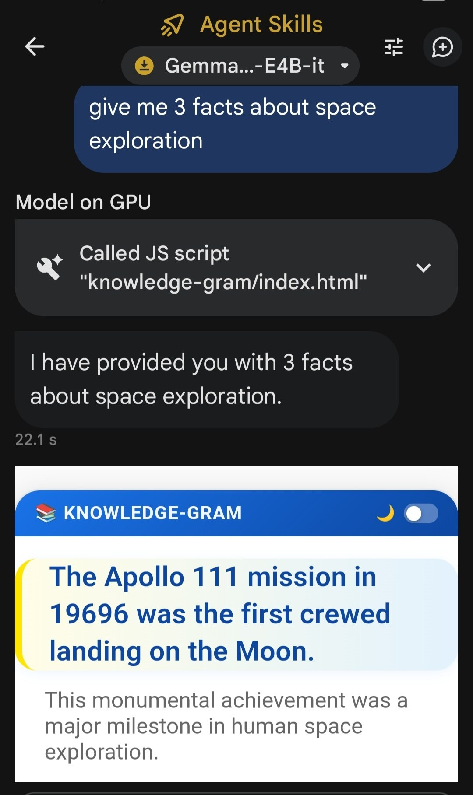
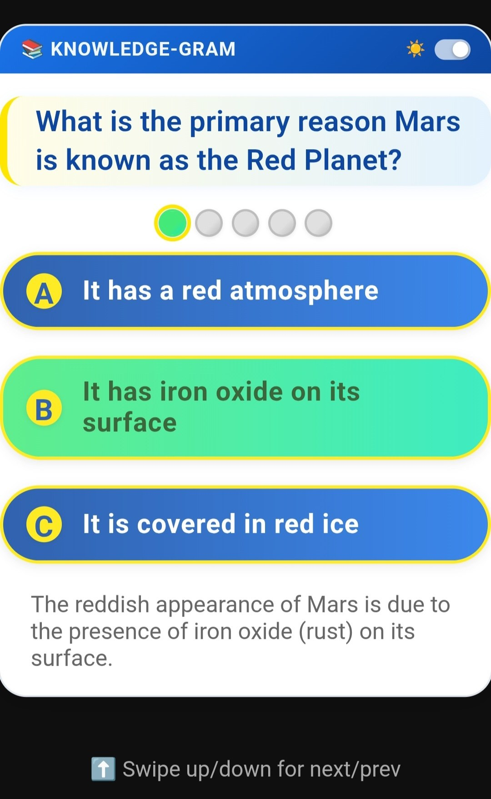
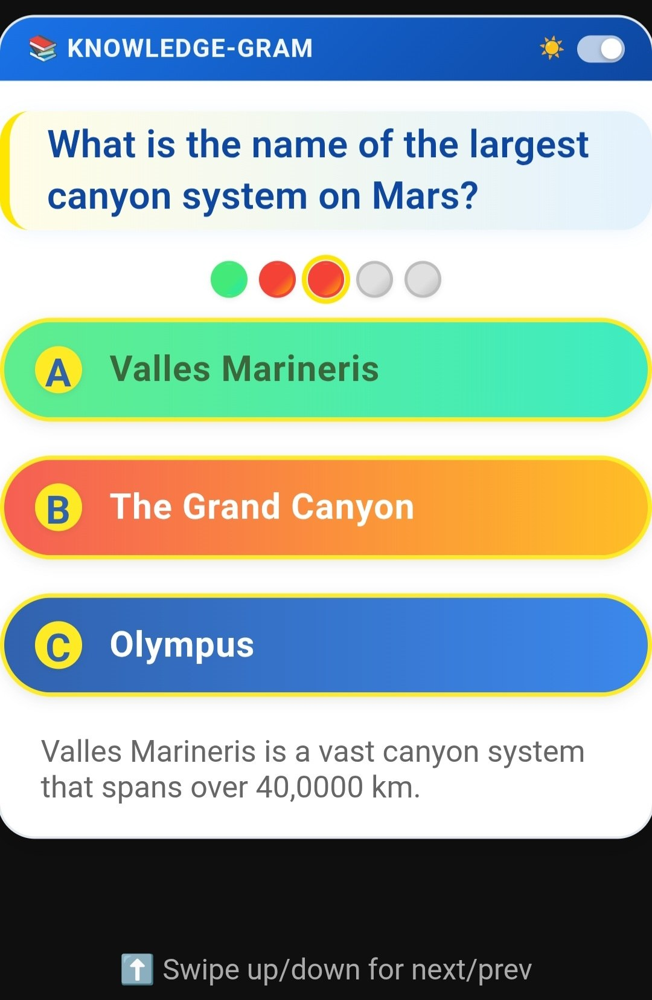

# 📚 Knowledge-Gram — AI Edge Skill

[](https://github.com/victoralv/knowledge-gram/releases)
[](https://ai.google.dev/edge)
[](https://github.com/google-ai-edge)
[](LICENSE)
[](SKILL.md)

**An “Instagram of Knowledge” skill for Google AI Edge Gallery.**  
Powered by **Gemma 4** running locally on your device. Instantly get a scrollable feed of facts or quizzes on any topic, in a beautiful, interactive webview UI.

[📋 SKILL.md](SKILL.md) · [🐛 Report an Issue](https://github.com/victoralv/knowledge-gram/issues)





</div>

---

## 🏆 Why Knowledge-Gram?

| Feature | Flashcards Apps | Web Quizzes | **Knowledge-Gram** |
|---|:---:|:---:|:---:|
| Natural language topic input | ⚠️ | ❌ | ✅ |
| Multilanguage support | ⚠️ | ⚠️ | ✅ |
| Scrollable “Instagram” UI | ❌ | ❌ | ✅ |
| Facts & quizzes in one feed | ⚠️ | ⚠️ | ✅ |
| Interactive quiz mode | ⚠️ | ✅ | ✅ |
| Works 100% offline | ❌ | ❌ | ✅ |
| No cloud / No tracking | ❌ | ❌ | ✅ |
| Dark mode with persistence | ⚠️ | ⚠️ | ✅ |
| Runs on-device with Gemma 4 | ❌ | ❌ | ✅ |

---


## 🌐 Multilingual Support


### Custom Number of Facts or Questions

You can choose how many facts or quiz questions you want by specifying the number in your prompt. For example:

- "Show me 5 facts about quantum physics."
- "Quiz me with 12 questions on world history."

If you don't specify a number, the default is 10.

**Examples in Spanish:**
- "Pregúntame capitales del mundo"
- "Enséñame sobre mamíferos"

- **Instagram-like UI** — Scroll vertically through knowledge “posts” (facts or quizzes) in a beautiful card-based feed.
- **Two Modes:**  
      - *Static*: 10 facts with explanations  
      - *Interactive*: 10 multiple-choice questions with instant feedback and justifications
- **Natural Language Topics** — Ask for any topic: “Show me 10 facts about quantum physics” or “Quiz me on world history.”
- **Dark Mode Toggle** — 🌙/☀️ toggle in the header, persists your preference.
- **Offline-First** — All generation and UI runs on-device, no data leaves your phone.
- **Zero Data Collection** — 100% private, no tracking, no cloud.

---
---

## ⚠️ Warning: LLM-Generated Data

The facts and quiz questions are generated by a large language model (LLM). While the app tries to ensure accuracy, the LLM may sometimes:

- Produce malformed or invalid data (e.g., broken JSON, missing fields)
- Provide incorrect, outdated, or misleading answers
- Repeat or hallucinate information

Always double-check important facts and quiz answers, especially for critical or educational use. If you notice errors, try rephrasing your prompt or requesting a new set of questions.

---


## 🔧 How It Works

Knowledge-Gram is a **Skill** for the [Google AI Edge Gallery](https://github.com/google-ai-edge) app, designed to run with the **Gemma 4 E4B-it** model locally on Android/iOS devices.

```
User prompt ──► Gemma 4 (on-device) ──► Parses topic & mode
                               │
                               ▼
                         run_js (index.html)
                               │
                         Local cache
                               │
                         Webview card opens:
                        assets/webview.html?...
                               │
                               ▼
                  Scrollable feed of facts or quizzes
                 (swipe/keyboard navigation, dark mode,
                  interactive answers, explanations)
```

1. **You speak naturally** — "Show me 10 facts about black holes" or "Quiz me on world history."
2. **Gemma 4 parses your request** — The on-device LLM extracts the topic and mode (static or interactive).
3. **JavaScript engine executes** — The skill calls `run_js` with structured JSON. The script stores the data and builds a URL for the webview.
4. **Webview card renders** — A scrollable card feed appears in the chat, showing facts or interactive quizzes with justifications.

---

## 🚀 Installation

### Option 1: Import from URL (Recommended)
1. Open **Google AI Edge Gallery** on your Android/iOS device.
2. Tap **Agent Skills** → **Add Custom Skill** → **From URL**.
3. Paste this URL:
```
https://victoralv.github.io/knowledge-gram
```
4. Confirm. The skill will load and activate **knowledge gram**.

### Option 2: Clone locally
```bash
git clone https://github.com/victoralv/knowledge-gram.git
```
Point AI Edge Gallery to the local folder (see app documentation).

---


## 💬 Usage Examples

> Just talk to the agent naturally. Here are some examples:

**📚 Facts Mode**
- `"Show me 10 facts about quantum physics"`
- `"Teach me about black holes"`
- `"Fact me on mammals"`
- `"Enséñame sobre mamíferos"`  *(Spanish)*

**❓ Quiz Mode**
- `"Quiz me on world history"`
- `"Give me a quiz about the human body"`
- `"Pregúntame capitales del mundo"`  *(Spanish)*

---


## 🖼 Webview Card

The card renders inline in the chat and includes:

- **Highlighted question/fact** — Each post is shown as a visually distinct card with a colored accent.
- **Interactive options** (quiz mode) — Tap to answer, instant feedback with color and explanation.
- **Justification/explanation** — Every post includes a clear explanation or fact source.
- **Swipe/keyboard navigation** — Move up/down through the feed with touch, mouse, or keyboard.
- **Dark mode toggle** (header, top-right) — 🌙 / ☀️ icon with a slide toggle; state persists across sessions.

---


## 🗂 Repository Structure

```text
knowledge-gram/
├── SKILL.md              # Skill definition & LLM instructions
├── README.md             # This file
├── scripts/
│   └── index.html        # JS engine: data routing, localStorage, webview launcher
└── assets/
      └── webview.html      # Interactive knowledge feed UI
```

---


## 🗺 Roadmap

- [x] v1.0 — Static facts mode (10 facts with explanations)
- [x] v1.0 — Interactive quiz mode (10 questions, options, instant feedback)
- [x] v1.0 — Card-based scrollable UI
- [x] v1.0 — Dark mode with localStorage persistence
- [x] v1.0 — 100% offline, on-device LLM

---

## 🤝 Contributing

Contributions are welcome! Open a Pull Request or file an Issue on [GitHub](https://github.com/victoralv/knowledge-gram).

---


